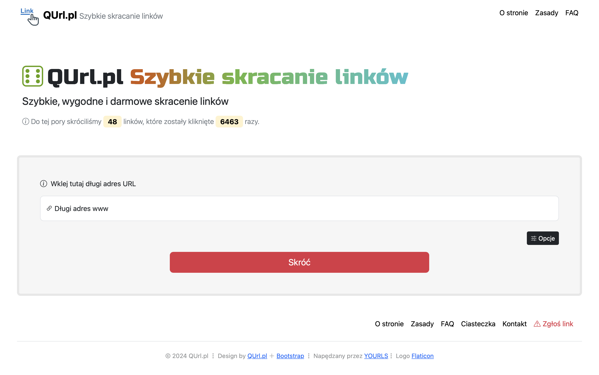

# QUrl Theme for YOURLS
A simple theme for [YOURLS](https://yourls.org) built based on the [Bootstrap](https://getbootstrap.com) framework.

  

## Requirements
Theme requires:
* YOURLS itself, of course
* YOURLS plugin [U-SRV](https://github.com/joshp23/YOURLS-U-SRV)
* YOURLS plugin [YOURLS-IQRCodes](https://github.com/joshp23/YOURLS-IQRCodes)
* [PHPMailer](https://github.com/PHPMailer/PHPMailer) library

## Installation
Installation involves copying the contents of the `QUrl-Theme` directory directly to the main directory where YOURLS was installed. After copying the theme files to the main YOURLS directory, install the required plugins.

### PHPMailer installation
To send e-mail notifications and for the contact form and the form to report suspicious links to work properly, it is necessary to install the PHPMailer library. The library files should be placed in the `qurl/PHPMailer` folder. 

## Configuration
The theme has basic configuration options. All options are located in the `qurl/config.php` file.
The theme can be translated into other languages. To do this, you need to create your own language file based on the file `PL-pl_qurl.php`, which is located in the `qurl/lang` directory.

## Preview
The theme is used on the website [QUrl.pl](https://qurl.pl)